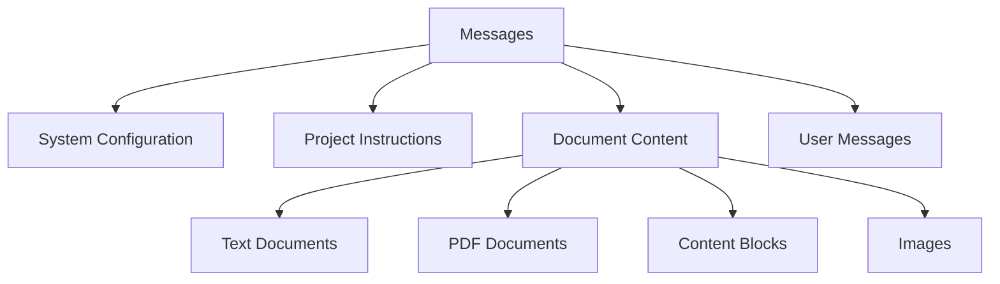

While diving deep into the Claude API recently, I noticed that the official documentation's description of message content types is somewhat scattered. This article will systematically introduce the various content types, data formats, and best practices in the Claude API.

<!--more-->

## Message Structure Overview

Claude API supports both JSON and XML formats. Each format has its characteristics:
- JSON format is more suitable for programmatic calls
- XML format is more suitable for use in prompts

A complete message structure should include:



## Content Types in Detail

Claude API supports the following content types:

### 1. text Type

The most basic text type, supporting plain text content:

```json
{
  "type": "text",
  "text": "Text content",
  "source": "source.txt",        // Optional
  "title": "Document title",     // Optional
  "context": "Document description" // Optional
}
```

### 2. pdf Type

Used for handling PDF documents:

```json
{
  "type": "pdf",
  "source": "document.pdf",
  "text": "<base64 encoded content>",
  "context": "PDF document metadata"
}
```

### 3. content Type

Used for structured content blocks:

```json
{
  "type": "content",
  "content": [
    {"text": "First content block"},
    {"text": "Second content block"}
  ],
  "source": "structured.txt"
}
```

### 4. image Type

Used for handling image content:

```json
{
  "type": "image",
  "source": {
    "type": "base64",
    "media_type": "image/jpeg",
    "data": "<base64 encoded image>"
  }
}
```

## Best Practice Example

Here's a complete API call example showing how to organize multiple content types:

```python
import anthropic
import base64

client = anthropic.Anthropic()

# Prepare PDF content
with open("document.pdf", "rb") as f:
    pdf_content = base64.b64encode(f.read()).decode()

# Prepare image content
with open("image.jpg", "rb") as f:
    image_content = base64.b64encode(f.read()).decode()

# Create message
message = client.messages.create(
    model="claude-3-5-sonnet-20241022",
    max_tokens=1024,
    messages=[
        {
            "role": "user",
            "content": [
                # System instructions
                {
                    "type": "text",
                    "text": "Process the document using the following rules...",
                    "context": "system instructions",
                    "title": "processing_rules.md"
                },
                # PDF document
                {
                    "type": "pdf",
                    "source": "document.pdf",
                    "text": pdf_content,
                    "context": "Main document for analysis"
                },
                # Structured content
                {
                    "type": "content",
                    "content": [
                        {"text": "Section 1: Introduction"},
                        {"text": "Section 2: Methods"}
                    ],
                    "source": "outline.txt"
                },
                # Image
                {
                    "type": "image",
                    "source": {
                        "type": "base64",
                        "media_type": "image/jpeg",
                        "data": image_content
                    }
                },
                # User question
                {
                    "type": "text",
                    "text": "Analyze the content of the above documents and images"
                }
            ]
        }
    ]
)
```

If using XML format in prompts, you can organize it like this:

```xml
<document>
  <source>main_doc.pdf</source>
  <context>Main document content</context>
  <content>
    <text>Document content...</text>
    <image>Base64 encoded image content</image>
  </content>
</document>
```

## Key Considerations

1. **Content Order**
   - System instructions should be placed first
   - Document content should be ordered by importance
   - Actual user questions should be placed last

2. **Field Usage**
   - `context` field for providing metadata descriptions
   - `title` field for brief identification
   - `source` field for file traceability

3. **Performance Optimization**
   - Use document references to avoid duplicate content
   - Mind size limits for PDFs and images (32MB)
   - Use prompt caching judiciously

## Usage Recommendations

1. **Maintain Consistency**
   - Choose either JSON or XML format and stick with it
   - Keep tag naming consistent
   - Maintain consistent document reference methods

2. **Structured Management**
   - Use nested structures to express hierarchical relationships
   - Organize multiple documents in a logical order
   - Clearly label document types and purposes

3. **Error Handling**
   - Validate base64 encoding integrity
   - Check file size limits
   - Handle format conversion exceptions

## Conclusion

Mastering the various content types in the Claude API can greatly improve work efficiency. The key is understanding the characteristics and appropriate use cases for each type, and continuously optimizing usage patterns in practice. I hope this article helps you better utilize the Claude API.
