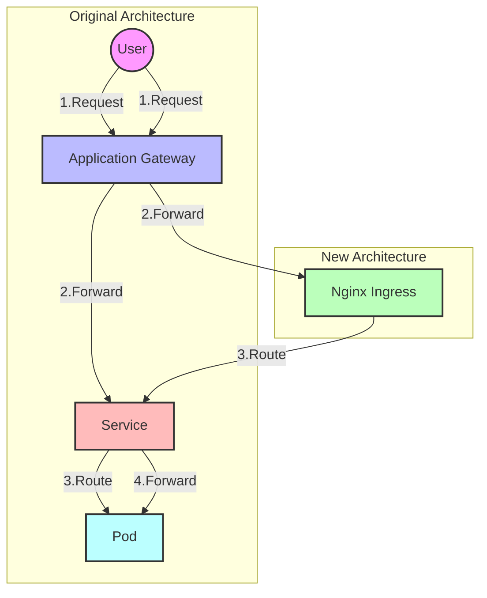
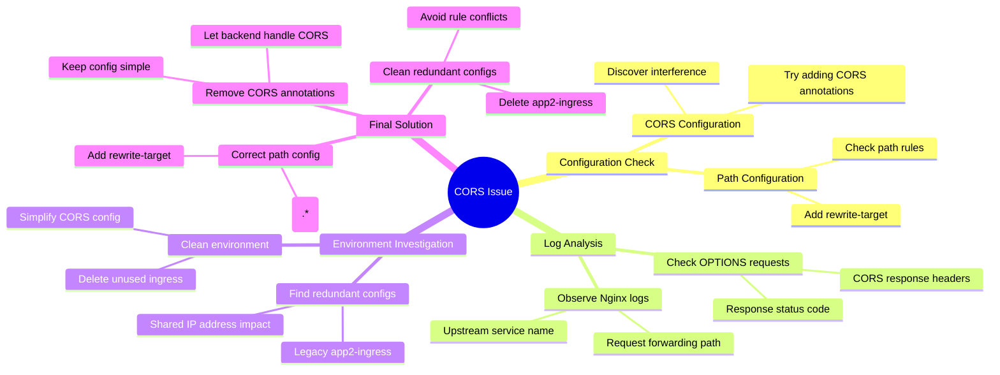

As a developer, have you ever encountered a situation where your service suddenly stops working, even though you haven't changed any code and all configurations seem correct? Today, I want to share a real-world case of debugging a CORS issue in a Kubernetes environment, hoping it might provide some insights for those facing similar challenges.

<!--more-->

## Background

Our web application is deployed on Azure Kubernetes Service (AKS), and the original architecture looked like this:

```
User Request -> Application Gateway -> Service -> Pod
```

To optimize performance, we needed to add a Nginx Ingress layer in between. The architecture changed as follows:



After configuration, we discovered CORS (Cross-Origin Resource Sharing) errors in the browser. While this issue seemed simple at first, the troubleshooting process turned out to be quite interesting.

## First Attempt: Adding CORS Configuration

As the "standard approach" to handling CORS issues, we first tried adding CORS-related settings in the Ingress configuration:

```yaml
annotations:
    nginx.ingress.kubernetes.io/enable-cors: "true"
    nginx.ingress.kubernetes.io/cors-allow-origin: "https://our-frontend-domain"
```

Result: Failed. The browser still reported CORS errors.

## Deep Investigation: Systematic Thinking

At this point, we began to analyze the problem systematically:

1. Check the OPTIONS request (preflight request) response:
```bash
curl -X OPTIONS -I \
  -H "Origin: https://our-frontend-domain" \
  -H "Access-Control-Request-Method: POST" \
  https://our-backend-domain
```

The response looked correct, including all necessary CORS headers.

2. Check Nginx Ingress logs:
```bash
kubectl -n ingress-namespace logs -l app=nginx-internal-0 -f
```

We found a crucial piece of information in the logs: requests were being forwarded to an unexpected service `[app2-app2-service-80]` instead of our expected `app1-service`.

## The Truth: Unexpected Configuration Conflict

Through log analysis, we discovered a forgotten Ingress configuration that was affecting our service. It's like having your WiFi signal interfered with by your neighbor's router — two configurations were "fighting" in the same environment.

In Azure AKS, all Ingress shares the same IP address, meaning that Ingress configurations from different projects can interfere with each other. We found that an unused `app2-ingress` configuration still existed and was interfering with our request routing.

## Solution: Simplifying Complexity

The final solution included three key steps:

1. Fix the Ingress path configuration:
```yaml
spec:
  rules:
  - http:
      paths:
      - path: /(.*) # Use wildcard to match all paths
        pathType: Prefix
        backend:
          service:
            name: app1-service
            port:
              number: 80
  annotations:
    nginx.ingress.kubernetes.io/rewrite-target: /$1 # Ensure correct path forwarding
```

2. Delete unused Ingress configurations:
```bash
kubectl delete ingress app2-ingress -n app2 
```

3. Remove all manually added CORS configurations (let the backend service handle CORS)

A special note about the first step's path configuration:
- `path: /(.*)` matches all request paths
- `rewrite-target: /$1` ensures requests are correctly forwarded to the backend service, maintaining the original path
- Without this configuration, all requests might be forwarded to the root path `/`, causing APP1 to malfunction

Problem solved!

## Lessons Learned

We can summarize this debugging process with the following mind map:



This debugging experience taught us several important lessons:

1. **Logs are Important**
   - Every detail in logs could be a clue
   - Pay special attention to which service requests are forwarded to (upstream information)

2. **Understand Environment Characteristics**
   - In AKS, the same Ingress Controller shares one IP
   - This means Ingress configurations from different projects can affect each other
   - Be particularly careful to clean up unused configurations

3. **Simpler Configuration is Better**
   - Sometimes "extra protection" can complicate things
   - If the backend service already handles CORS correctly, don't configure it again at the Ingress layer

4. **Think Systematically**
   - The problem might not be where you first suspect
   - Check each component methodically, looking for anomalies

## Practical Advice

If you encounter similar issues in a Kubernetes environment, follow this troubleshooting process:

1. Check logs, particularly focusing on request forwarding paths
2. Examine all related configurations, including seemingly unrelated old ones
3. Start with simple solutions
4. Keep the environment clean, promptly remove unused configurations

Finally, I want to say: in microservice architectures, problems are often not as simple as they appear. But with patience and systematic analysis, we can always find a solution. While debugging can be frustrating at times, each successful investigation deepens our understanding of the system.

I hope this article helps you when facing similar issues. If you have similar experiences or other thoughts, feel free to share in the comments!
