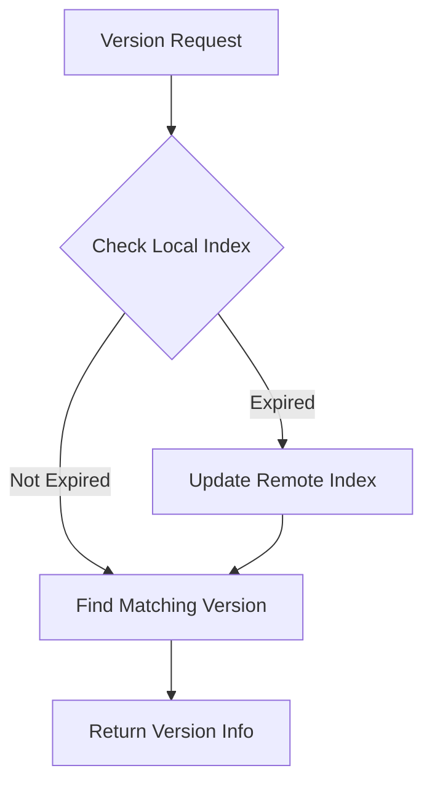
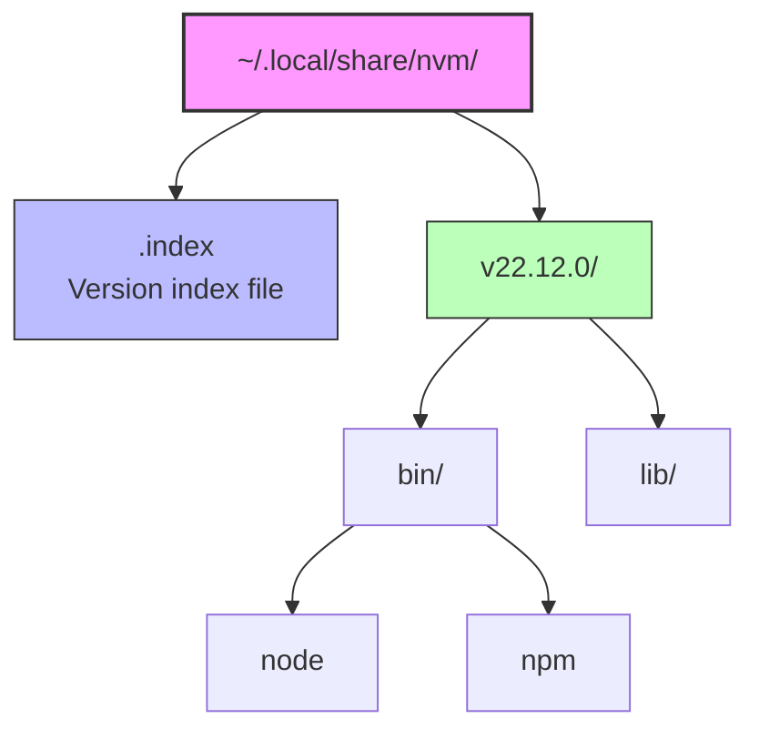

Node.js version management is a crucial topic in modern frontend development. Different projects may require different versions of Node.js, so how do we elegantly solve this problem in a fish shell environment? Let's dive deep into the working principles and best practices of nvm.fish.

<!--more-->

## Core Issues in Version Management

Node.js version management essentially needs to solve the following problems:

1. Binary Management: How to download, store, and organize different versions of Node.js binary files
2. Environment Variables: How to dynamically modify PATH and other environment variables to switch Node.js versions in the current shell session
3. Project Association: How to associate specific projects with specific Node.js versions
4. Dependency Management: How to handle compatibility of globally installed npm packages across different Node.js versions

## Implementation Principles of nvm.fish

### 1. Version Storage Structure

nvm.fish adopts a clean filesystem structure:

```
~/.local/share/nvm/
├── v14.17.0/
│   ├── bin/
│   │   ├── node
│   │   └── npm
│   └── lib/
├── v16.14.0/
└── .index    # Version index file
```

Each version has its own directory containing complete binary files and dependent libraries.

### 2. Environment Variable Management

nvm.fish implements version switching through fish's environment variable mechanism:

```fish
function _nvm_version_activate --argument-names ver
    set --global nvm_current_version $ver
    set --prepend PATH $nvm_data/$ver/bin
end

function _nvm_version_deactivate --argument-names ver
    set --erase nvm_current_version
    set --erase PATH
end
```

This implementation ensures:
- Version switching only affects the current shell session
- Different terminal windows can use different Node.js versions
- Quick rollback to system default version

### 3. Automatic Version Detection

nvm.fish uses recursive upward search to locate configuration files:

```fish
function _nvm_find_up --argument-names path file
    test -e "$path/$file" && echo $path/$file || begin
        test ! -z "$path" || return
        _nvm_find_up (string replace --regex -- '/[^/]*$' "" $path) $file
    end
end
```

This design allows:
- Automatic detection of project Node.js version requirements from any subdirectory
- Support for multiple configuration file formats (.nvmrc, .node-version)
- Maintenance of project configuration inheritance relationships

## Advanced Features and Best Practices

### 1. Remote Index Caching

nvm.fish maintains a local version index, through which it can:
- Quickly find available Node.js versions
- Support version aliases (like lts, latest)
- Implement smart version matching



### 2. Architecture Adaptation

nvm.fish can intelligently detect system architecture and download corresponding binary files:

```fish
switch $arch
    case i*86
        set arch x86
    case x86_64
        set arch x64
    case arm64
        string match --regex --quiet "v(?<major>\d+)" $ver
        if test "$os" = darwin -a $major -lt 16
            set arch x64
        end
end
```

This design handles:
- Different CPU architectures (x86, x64, ARM)
- Special cases (like M1 Mac's Rosetta 2 emulation)
- Compatibility issues with historical versions

### 3. Mirror Support

To accommodate different regional network environments, nvm.fish provides mirror configuration:

```fish
# Use custom mirror
set -g nvm_mirror https://npmmirror.com/mirrors/node

# Supported download mode
function _nvm_download
    command curl --silent $nvm_mirror/$ver/$dir.$ext
end
```

### 4. Shell Integration

nvm.fish provides a rich command-line experience through fish's completion system:

```fish
complete --command nvm --exclusive --condition __fish_use_subcommand
complete --command nvm --exclusive --condition "__fish_seen_subcommand_from install" --arguments "(
    test -e $nvm_data && string split ' ' <$nvm_data/.index
)"
```

This design provides:
- Context-aware command completion
- Dynamic version list
- Real-time command hints

## Engineering Practices

### 1. Project Standardization

Recommended to use `.nvmrc` file for managing Node.js versions in projects:

```bash
# .nvmrc
16.14.0
```

Working with CI/CD systems:

```yaml
# GitHub Actions example
steps:
  - uses: actions/checkout@v2
  - name: Setup Node.js
    run: |
      curl -o- https://raw.githubusercontent.com/fish-shell/nvm.fish/main/install.sh | fish
      nvm install
```

### 2. Team Collaboration

To ensure team members use consistent Node.js versions:

1. Clearly specify version requirements in project documentation
2. Use git hooks to automatically check Node.js version
3. Configure editor integration (like VSCode workspace settings)

## Future Outlook

As the Node.js ecosystem evolves, version management tools continue to evolve:

1. Containerization Trends
   - Development environment containerization
   - Multiple versions running in parallel
   - Isolated dependency management

2. New Package Management Tools
   - Rise of pnpm
   - Continuous innovation in yarn
   - Steady evolution of npm

3. Cross-platform Support
   - ARM architecture popularization
   - Cloud development environments
   - Remote development modes

nvm.fish's design has reserved expansion space for these changes, and through its modular structure and clear interfaces, it can adapt to future development needs.

## Summary

nvm.fish elegantly solves the Node.js version management problem in fish shell environments through its elegant design and powerful features. It not only provides a convenient user experience but also plays an important role in engineering practices. As development modes evolve, such tools will continue to play a key role in improving development efficiency.

---

- Illustration: nvm.fish filesystem structure diagram


- Illustration: Environment variable changes during version switching
```fish
$ echo "16.14.0" > .nvmrc
$ cd ..
$ nvm use lts
Now using Node v22.12.0 (npm 10.9.0) ~/.local/share/nvm/v22.12.0/bin/node
$ nvm list
   v16.14.0 lts/gallium
 ▶ v22.12.0 lts/jod
$ z -
$ nvm use
Now using Node v16.14.0 (npm 8.3.1) ~/.local/share/nvm/v16.14.0/bin/node
$ nvm list
 ▶ v16.14.0 lts/gallium
   v22.12.0 lts/jod
```
