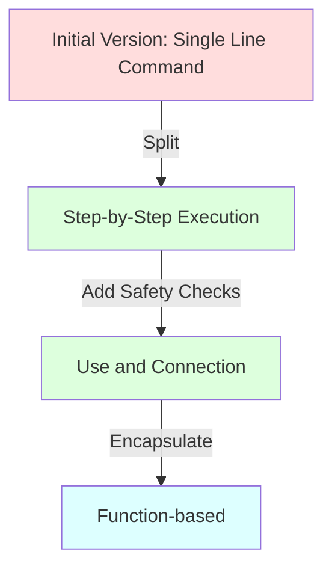
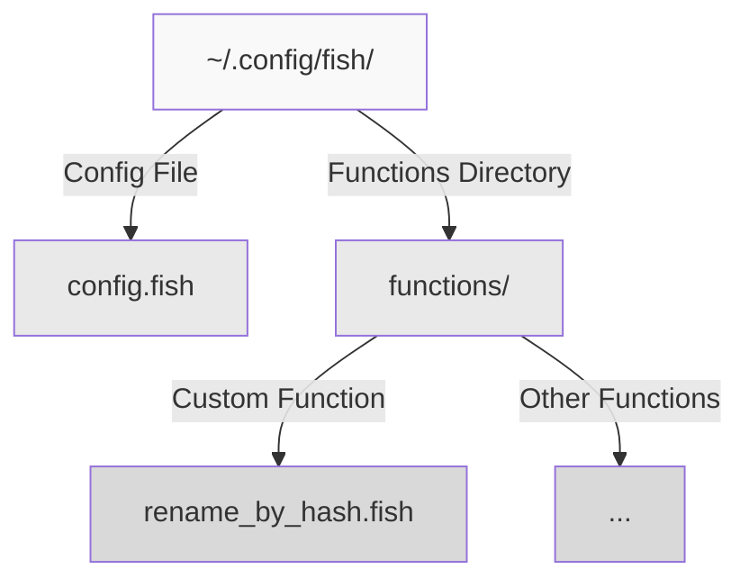

In our daily work, we often need to batch process files, such as renaming files based on their content characteristics. If you're new to shell programming, this might seem like a simple task. However, safely completing this work involves many details and best practices. Let's explore the safety features of Fish Shell through a specific example.

<!--more-->

## Starting with Requirements

Let's say we have this requirement: rename a JPEG image and its corresponding text description file, where the new filename should include the MD5 value of the text file and the timestamp of the image file. This is a typical file processing task that involves:

1. Calculating the MD5 value of a file
2. Getting the file's timestamp
3. Renaming two related files

## Common Beginner's Approach

If you've used Bash or Zsh before, you might write something like this:

```bash
mv sample.jpeg "$(md5 sample.txt | awk '{print $NF}').t$(gstat --format=%W sample.jpeg).jpeg"
```

This command works in Bash or Zsh. However, when you try to run it in Fish Shell, you'll find it doesn't execute as expected.

## Fish Shell's Safety Philosophy

Why doesn't the same command work in Fish Shell? This involves an important design principle of Fish Shell: Conservative Evaluation.

In Bash/Zsh, when encountering `$(...)` or backticks, the shell immediately executes the command and substitutes the result. While this "greedy evaluation" is convenient, it brings security risks:
- Commands in strings are automatically executed, potentially leading to unexpected command execution
- Error handling is unclear, failures in intermediate steps might be ignored
- Error propagation in command chaining isn't explicit enough

Fish Shell takes a different approach:
1. Command substitution in strings isn't automatically executed
2. Explicit use of `eval` or other methods is required to execute commands
3. A more structured approach to organizing commands is recommended

## Step-by-Step Improvements

Let's see how to improve this command step by step:



### 1. Step-by-Step Execution
First, we can split the operation into multiple steps:

```fish
set md5sum (md5 sample.txt | awk '{print $NF}')
set timestamp (gstat --format=%W sample.jpeg)
mv sample.jpeg "$md5sum.t$timestamp.jpeg"
```

Benefits of this approach:
- Each step is clearly visible
- Easy to check intermediate results
- Convenient for debugging

### 2. Using and Connection for Safety

Further improving, we use `and` to ensure each step succeeds:

```fish
set md5sum (md5 sample.txt | awk '{print $NF}'); and \
set timestamp (gstat --format=%W sample.jpeg); and \
mv sample.jpeg "$md5sum.t$timestamp.jpeg"; and \
mv sample.txt "$md5sum.txt"
```

Benefits of this approach:
- If any step fails, subsequent steps won't execute
- Avoids situations where some files are renamed while others fail
- Maintains file consistency

### 3. Encapsulating as a Function

Finally, we can encapsulate this functionality into a reusable function:

```fish
function rename_by_hash
    set -l txt_file $argv[1]
    set -l jpeg_file $argv[2]
    
    if test ! -f $txt_file; or test ! -f $jpeg_file
        echo "Usage: rename_by_hash text_file jpeg_file"
        return 1
    end
    
    if set -l md5sum (md5 $txt_file | awk '{print $NF}')
        and set -l timestamp (gstat --format=%W $jpeg_file)
        mv $jpeg_file "$md5sum.t$timestamp.jpeg"
        and mv $txt_file "$md5sum.txt"
        echo "Files renamed successfully"
    else
        echo "Error occurred during renaming"
        return 1
    end
end
```

This final version has many excellent features:
- Input validation: checks if files exist
- Error handling: provides clear error messages
- Flexibility: can handle arbitrary filenames
- Reusability: encapsulated as a function for repeated use
- User-friendly: operation results are clearly visible

## Key Points of Safe Programming in Fish Shell

Through this example, we can summarize several important principles of safe programming in Fish Shell:

1. **Explicit over Implicit**:
   - Command execution should be explicit, not hidden in strings
   - Variable scope should be clear (use -l flag for local variables)

2. **Progressive Error Handling**:
   - Use `and` to chain related commands
   - Perform condition checks before important operations
   - Provide meaningful error messages

3. **Structured Programming**:
   - Encapsulate related operations as functions
   - Use meaningful variable names
   - Add appropriate comments and prompts

4. **Safety Checks**:
   - Verify input file existence
   - Check command execution results
   - Maintain operation atomicity

5. **User-Friendly**:
   - Provide clear usage instructions
   - Output operation status
   - Maintain code readability

## Practical Recommendations

1. Test each step in the command line when developing new features
2. Gradually add error handling after confirming basic functionality
3. Consider encapsulating as a function when finding certain operations are frequently repeated
4. Save commonly used functions to the `~/.config/fish/functions/` directory
5. Regularly review and update existing functions to ensure they comply with the latest safety practices



## Summary

Fish Shell's safety features might seem strict when first encountered, but these restrictions actually help us write safer and more reliable code. By following these principles, we can:
- Avoid common shell programming pitfalls
- Create more maintainable code
- Provide better user experience

As you gradually adapt to this programming style, you'll find that these "restrictions" are actually helping you build more robust systems.
