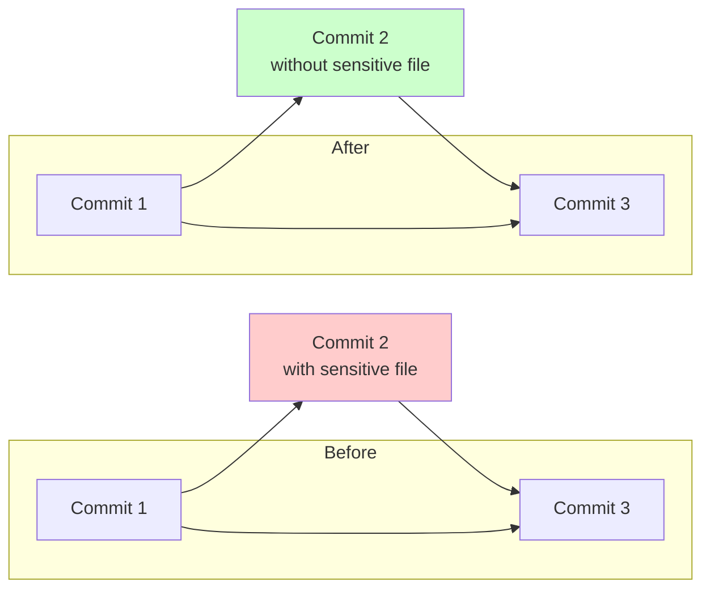

Accidentally committed sensitive files (like configuration files or keys) to your Git repository? Don't panic - this article will show you how to handle this situation cleanly and effectively.

<!--more-->

## Problem Scenario

Let's say during development, you accidentally committed a configuration file `config.secret.yaml` containing sensitive information to your Git repository. This file was added in a commit two days ago, and now you need to:
1. Completely remove this file from Git history
2. Keep other code changes unaffected
3. Ensure the file remains available locally but is no longer tracked by Git

## Solution Steps

### 1. Locate the Sensitive File Commit

First, we need to find the commit that introduced the sensitive file. If you remember it was in one of the recent commits, you can use this command:

```bash
git diff HEAD~3 HEAD~2 --name-only
```

This command will show the list of files added or modified between the third-to-last and second-to-last commits.

### 2. Use Interactive Rebase

After finding the relevant commit, we use interactive rebase to modify history:

```bash
git rebase -i HEAD~3 --committer-date-is-author-date
```

This command will open an editor showing a list of the last three commits, like this:

```text
pick abc1234 feat: add new feature
pick def5678 feat: update config file  # This is the commit with sensitive file
pick ghi9012 feat: fix issues
```

### 3. Mark the Commit for Editing

In the editor, change the `pick` to `edit` for the commit containing the sensitive file:

```text
pick abc1234 feat: add new feature
edit def5678 feat: update config file  # Change this line
pick ghi9012 feat: fix issues
```

Save and close the editor.

### 4. Remove the Sensitive File

Git will pause at the commit you marked as `edit`. Now, use this command to remove the sensitive file:

```bash
git rm --cached config.secret.yaml
```

This command will remove the file from Git version control while keeping it in your working directory.

### 5. Update the Commit

After removing the file, use `--amend` to update this commit:

```bash
git commit --amend
```

### 6. Complete the Rebase

Finally, continue with the rebase process:

```bash
git rebase --continue
```

### 7. Prevent Future Accidental Commits

To prevent accidentally committing sensitive files in the future, immediately create or update the `.gitignore` file:

```bash
echo "config.secret.yaml" >> .gitignore
git add .gitignore
git commit -m "chore: update .gitignore to exclude sensitive files"
```

## Understanding the Process

Let's understand this process with a simple analogy:



- Imagine you're organizing a photo album (Git history)
- You discover a page (commit) containing a photo that shouldn't be there (sensitive file)
- Using `git rebase -i` is like stopping at that page
- `git rm --cached` is like removing that unwanted photo
- `git commit --amend` is like resealing that page
- Finally, `git rebase --continue` is like closing the album, completing the reorganization

## Important Considerations

1. If the repository has been pushed to remote, you'll need to use `git push --force` to update the remote repository
2. It's best to create a backup branch before proceeding: `git branch backup-before-remove`
3. If it's a team collaboration project, ensure other members know about your history modification
4. Use the `--committer-date-is-author-date` parameter to maintain commit timestamp consistency

## Conclusion

The advantages of this method are:
- Precise: Only removes the specified sensitive file without affecting other changes
- Clean: Completely removes from Git history without leaving traces
- Safe: Local files remain unchanged, just no longer tracked by Git

Remember, prevention is better than cure. Setting up a good `.gitignore` file can help you avoid many unnecessary troubles. If your project might contain sensitive files, it's recommended to set up appropriate ignore rules at the project's inception.

Finally, if you need to handle more complex situations (like removing certain types of files from the entire project history), consider using the `git-filter-repo` tool, which is safer and more efficient than the traditional `git filter-branch`.
