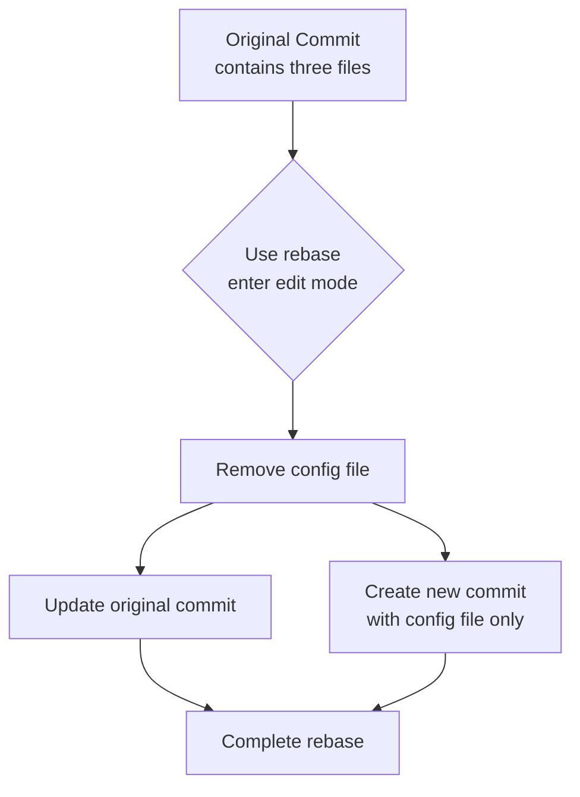

John recently worked on a new feature and just committed some code. After committing, he suddenly realized that he accidentally included an unfinished configuration file in the commit. He wants to separate this file from the recent commit and commit it separately. How should he do this?

<!--more-->

## Background

This scenario is quite common:
- You just used `git commit` to commit a batch of files
- Suddenly you realize one of the files shouldn't have been committed with the others
- You want to take this file out of the recent commit and commit it separately

For example:
- A configuration file should be committed separately for easier rollback later
- Test code for a new feature should be committed separately from the implementation
- You accidentally committed experimental code along with production code

## Solution

Let me show you a method that's both safe and preserves commit information.

### Step 1: Create a Backup Branch (Just in Case)
```fish
git branch tmp-backup
```

This step isn't mandatory, but it's highly recommended to develop this habit. If something goes wrong with the following operations, you can always return to this backup.

### Step 2: Start Modifying the Recent Commit
```fish
git rebase -i HEAD^
```
This will open an editor where you'll see your most recent commit. Change the `pick` at the beginning to `edit`, then save and exit.

```git
edit a3a4837 fix: update handlers to use custom exceptions
pick 3802508 fix: fix logging and variable initialization
pick aae0dbd fix: fix logger function calls
pick eb07cc8 test: update test cases for custom exceptions
pick 62ef260 docs: update changelog for v0.2.9
```

### Step 3: Separate the File
```fish
# Remove the file to be separated from the current commit
git reset HEAD^ filename-to-separate
# Update the original commit (now without that file)
git commit --amend

# Create a new commit containing only the separated file
git add filename-to-separate
git commit -m "new commit message"
```

### Step 4: Complete the Modification
```fish
git rebase --continue
```

### Step 5: Delete Backup After Confirmation (Optional)
```fish
git branch -D tmp-backup
```

## Real Example

Let's understand this process through a specific example:

Suppose John is developing a website and he just committed these files:
- `index.html` (main page update)
- `style.css` (style modifications)
- `config.dev.json` (development environment configuration)

After committing, he realizes that `config.dev.json` should be committed separately because this configuration file might need to be rolled back independently in the future.



## Important Notes

1. Before starting, ensure:
   - Your working directory is clean (no uncommitted changes)
   - You're certain about modifying the most recent commit

2. In some cases, the order of separating files is important:
   - For configuration files, commit the base configuration first, then the code that uses it
   - For test files, commit the code being tested first, then the test cases

## Preventive Measures

The best solution is actually prevention: spend a little more time checking files before committing. You can:

1. Use `git status` to review the list of files to be committed
2. Be careful when selecting files with `git add`, instead of using `git add .`
3. Use `git diff --cached` for a final confirmation before `git commit`

## Tips

Developing good habits is important. If you find that your changes can be divided into independent parts (like "bug fix" and "new feature"), it's better to commit them separately during development rather than splitting them up later.

Remember: Good code commits should be like telling a story, where each commit is an independent, meaningful chapter. This not only makes it easier to review history later but also makes it convenient to roll back specific changes when needed.
