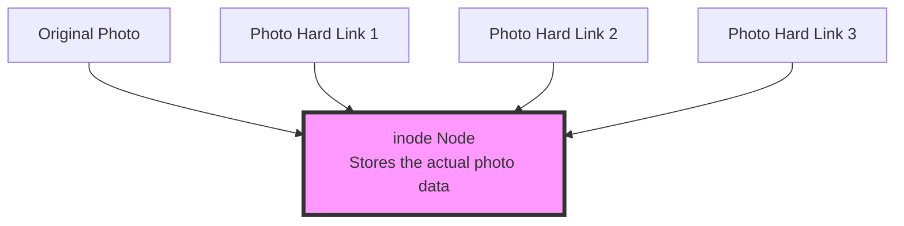

Imagine this scenario: You and your roommate share an apartment, and each of you needs a copy of "Professional JavaScript" for studying. Conventionally, you might each buy a copy — this is like traditional file copying. But what if there was a way to share the same book while each having access to it in your own room? That would save money and be convenient, right? This is the concept behind Hard Links.

And pnpm, an increasingly popular package manager, uses similar wisdom to save disk space. Let's understand this seemingly complex technical concept through this article in a simple way.

<!--more-->

## Hard Links: Not Copying, But Creating Avatars

### What is a Hard Link?

Imagine you have a family photo:
- If you directly copy this photo, you get two independent files, each taking up the same amount of space
- But if you create a hard link to this photo, it's like putting "avatars" of the same photo in different albums, where all these "avatars" point to the same photo



Characteristics of hard links:
1. No extra space: All hard links point to the same actual file content
2. Stay synchronized: Changes made through any link are visible through all links
3. High security: The file is only truly deleted when the last hard link is removed

### Real-Life Analogy

It's like:
- A family sharing one TV, with a remote control in each room
- No matter which remote you use to change channels, the TV switches to the same channel
- As long as one remote works, you can control the TV
- The TV (file content) takes up space, while remotes (hard links) take almost no space

## pnpm: The Smart Package Manager

### How Does pnpm Use Hard Links?

pnpm cleverly uses a combination of hard links and symbolic links (soft links):

```mermaid
graph TD
    A[Global Store<br>.pnpm-store] --> B[react@18.2.0]
    A --> C[lodash@4.17.21]
    A --> D[typescript@5.0.0]
    
    subgraph "Project A"
    E[node_modules/.pnpm/react@18.2.0] -.Hard Link.-> B
    F[node_modules/react] -.Symbolic Link.-> E
    end
    
    subgraph "Project B"
    G[node_modules/.pnpm/react@18.2.0] -.Hard Link.-> B
    H[node_modules/react] -.Symbolic Link.-> G
    end

    style A fill:#f9f,stroke:#333,stroke-width:4px
```

How it works:
1. Global store: All packages are first installed in a unified location (like a library)
2. Hard links: When a project needs a package, it creates hard links to the global store (like borrowing from the library without moving the book)
3. Symbolic links: Creates the correct dependency structure (like the library's indexing system)

### Practical Benefits

This design brings several advantages:

1. Space Savings
```bash
# Traditional way: three projects each install react
projectA/node_modules/react  // takes 5MB
projectB/node_modules/react  // takes 5MB
projectC/node_modules/react  // takes 5MB
Total: 15MB

# pnpm way
.pnpm-store/react          // takes 5MB
projectA/node_modules/react // almost no space (hard link)
projectB/node_modules/react // almost no space (hard link)
projectC/node_modules/react // almost no space (hard link)
Total: about 5MB
```

2. Fast Installation
- Because multiple projects share the same global store
- If a package is already in the global store, it only needs to create links, no need to download again

3. Clear Dependency Structure
- Each project's node_modules structure is clean
- Dependency relationships are easier to understand and manage

## Usage Recommendations

1. Development Environment Considerations:
   - IDEs might show multiple identical files (due to hard links)
   - Be careful when modifying dependency packages, as it affects all projects using that package

2. Debugging Tips:
   - If you need to temporarily modify a package, better make a copy first instead of modifying directly
   - Use `pnpm store path` to check the global store location
   - Use `pnpm store prune` to clean up unused packages

3. Team Collaboration:
   - Recommend the team to use pnpm uniformly, avoid mixing different package managers
   - Use `.npmrc` configuration file in projects to enforce pnpm usage

## Conclusion

Through the clever technology of hard links, pnpm not only saves significant disk space but also provides faster installation speeds and clearer dependency management. Understanding this concept helps you better leverage pnpm's advantages and understand why it's becoming increasingly popular.

Just like our initial example of sharing books, pnpm allows all projects to intelligently share the same dependencies while ensuring each project can operate independently. This is the beauty of technological innovation!
