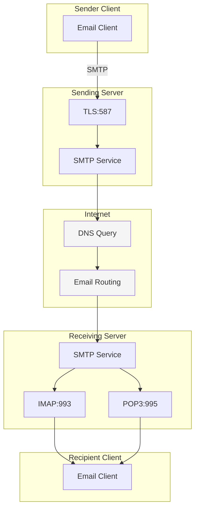
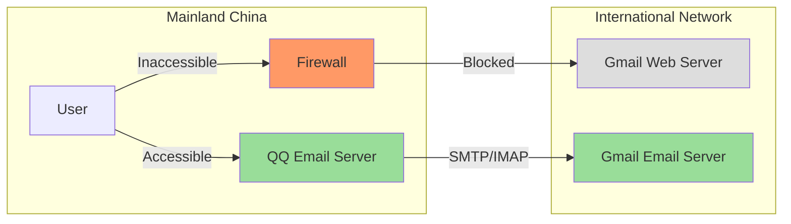

In this era of global connectivity, email has become an indispensable communication tool in our daily lives. However, when we send an international email, behind this seemingly simple process lies complex technical mechanisms and multiple security considerations. This article will deeply analyze the complete process of international email transmission to help you understand the technical principles.

<!--more-->

## Starting with a Case Study

Xiao Li, working in the Dubai branch, received an electronic bill from a domestic bank and needed to forward it to his personal email for archiving. After pressing the send button, this email will embark on a long and complex journey. Let's use this real scenario to deeply understand how modern email systems work.

## Email Protocol Architecture

Modern email systems are primarily based on three core protocols:

1. SMTP (Simple Mail Transfer Protocol)

   - Runs on TCP port 25 (encrypted version uses port 587)
   - Responsible for sending and relaying emails
   - Uses a store-and-forward mechanism to ensure reliable transmission
2. IMAP/POP3 (Receiving Protocols)

   - IMAP: port 993, supports two-way synchronization
   - POP3: port 995, used for downloading emails
   - Both protocols use different email management strategies

### Displaying Email Protocol Architecture Flowchart

## Email Encryption Mechanisms

Email systems use multi-layered encryption strategies:

1. Transport Layer Encryption (TLS)

   - Protects email security during transmission
   - Prevents man-in-the-middle attacks
   - Does not protect email storage on servers
2. End-to-End Encryption (such as PGP)

   - Provides true end-to-end security
   - Email content is only visible to the sender and recipient
   - Uses asymmetric encryption technology

## International Transmission Path Analysis

### Physical Infrastructure

International email transmission primarily relies on undersea fiber-optic cable networks:

- The speed of light in fiber-optic cables is approximately 200,000 km/s
- Actual transmission speed is limited by network devices and routing policies
- Geographic distance causes unavoidable delays

### Email Transmission Timeline

Let's take a look at the detailed transmission timeline of an email with a 760.9KB attachment:

```mermaid
%%{init: {'theme': 'default', 'gantt': {'useWidth': 600} } }%%
gantt
    title International Email Transmission Timeline
    dateFormat ss
    axisFormat %S seconds
  
    section Sending Stage
    Authentication and Check :active, task1, 00, 0.5s
    Attachment Virus Scanning   :task2, after task1, 2s
  
    section Transmission Stage
    UAE Exit Check :task3, after task2, 1.5s
    Network Transmission      :task4, after task3, 0.6s
    China Firewall Check :task5, after task4, 3.4s
  
    section Receiving Stage
    QQ Email Security Check :task6, after task5, 2s
    Email Classification and Delivery :task7, after task6, 1s

```

## Security Check Mechanisms

### Sender-Side Security Measures

1. SPF (Sender Policy Framework)

   - Verifies sender identity
   - Prevents email spoofing
   - Checks if the sending server is authorized
2. DKIM (DomainKeys Identified Mail)

   - Uses encrypted signatures to ensure email integrity
   - Prevents content tampering
   - Verifies the authenticity of the sender's domain

### Gateway Checks

1. International Exit Checks

   - Traffic monitoring
   - Content compliance checks
   - Anti-spam filtering
2. Firewall Policies

   - Protocol-level control
   - Traffic shaping
   - Security threat detection

### Recipient-Side Processing

1. Anti-Spam Mechanisms

   - Content-based filtering
   - Sender reputation systems
   - Behavioral characteristic analysis
2. Virus Scanning

   - Attachment security checks
   - Malicious link detection
   - Macro virus protection

## Special Case Analysis: Gmail Access Mechanism

An interesting phenomenon is that although Gmail's web interface is inaccessible in mainland China, it is still possible to send and receive emails with Gmail accounts through local email services like QQ Email. This involves several key characteristics of email systems:

1. Protocol Separation

   - Web access (HTTP/HTTPS) and email sending/receiving (SMTP/IMAP) use different protocols
   - Firewalls can precisely control access permissions for different protocols
   - Email-specific ports remain open
2. Infrastructure Separation

   - Email servers and web servers are deployed separately
   - Globally distributed email relay nodes
   - Local email servers act as relay stations

### Gmail Access Mechanism Diagram

## Performance Optimization Suggestions

For users who frequently handle international emails, consider the following measures to improve your experience:

1. Technical Level

   - Use IMAP instead of POP3 protocol
   - Configure synchronization intervals reasonably
   - Consider enabling email compression
2. Practical Suggestions

   - Use cloud storage for large file sharing
   - Combine important notifications with instant messaging tools
   - Avoid triggering deep security checks

## Future Outlook

As technology advances, international email transmission may undergo new changes:

1. New Technology Applications

   - Quantum encryption applications
   - AI-assisted intelligent routing
   - Blockchain technology in email authentication
2. Infrastructure Upgrades

   - Deployment of new-generation undersea fiber-optic cables
   - Satellite communication supplementary schemes
   - Edge node optimization

## Conclusion

Understanding how email systems work not only helps us comprehend the reasons for delays but also enables us to better utilize this important communication tool. As technology continues to advance, we look forward to seeing faster and more secure international email transmission services.
