Have you ever experienced sending an international email, even to your own alternate email address, and had to wait a long time to receive it? What causes this delay? Let's explore what an email goes through during its international journey.

<!--more-->

## An Email Journey from Dubai to Shenzhen

Li, working at a branch office in Dubai, received an electronic statement from his bank in China and wanted to forward it to his personal email for archiving. After clicking send, he expected to receive it within seconds, but several minutes passed without any sign of the email. This situation is actually quite common because emails have to go through a "long" journey.

## Why Do Emails Get Delayed?

Just like international packages need to go through customs inspection, international emails must pass through multiple "checkpoints":

1. Sender-side Checks
   After you click send, your company's email server first verifies your identity, checks if the email size exceeds limits, and performs other checks. This is similar to a courier checking if a package meets requirements during pickup.
2. International Transmission
   The email passes through multiple network nodes, like an airplane going through multiple transit points. Each node may introduce some delay due to network congestion.

3. Entry Inspection
   When entering the destination country, emails must pass through gateway checks, similar to packages going through customs. This process can take anywhere from a few seconds to several minutes.
4. Final Delivery
   Finally, the destination email server (like QQ Mail) performs spam filtering, virus scanning, and other security checks before allowing you to see the email.

## Real Case Analysis

Let's look at a real example: a blank email with a 760.9KB attachment sent from UAE to a QQ mailbox in China. Under ideal conditions:

- Pure network transmission takes less than 1 second
- Various necessary checks and processing take over 10 seconds
- Actual delivery usually takes 1-3 minutes

```mermaid
%%{init: {'theme': 'default', 'gantt': {'useWidth': 600} } }%%
gantt
    title International Email Transmission Timeline
    dateFormat ss
    axisFormat %S sec
  
    section Sending Phase
    Authentication & Checks :active, task1, 00, 0.5s
    Attachment Virus Scan   :task2, after task1, 2s
  
    section Transmission Phase
    UAE Exit Check :task3, after task2, 1.5s
    Network Transfer      :task4, after task3, 0.6s
    China Firewall Check :task5, after task4, 3.4s
  
    section Receiving Phase
    QQ Mail Security Check :task6, after task5, 2s
    Email Classification & Delivery :task7, after task6, 1s
```

## Why is Webmail Faster Than Email Clients?

Interestingly, you might notice that new emails appear faster when accessing your email through a web browser compared to Outlook or other email clients. This is because:

- Webmail connects directly to the email server, showing new emails immediately
- Email clients sync at preset intervals, which might mean waiting several minutes

## Practical Tips

If you frequently send and receive international emails:

- Avoid using sensitive keywords in your emails
- Control attachment sizes, use cloud storage when necessary
- For urgent matters, consider using instant messaging tools
- Adjust your email client's sync frequency appropriately

Now, when you experience delays with international emails, you'll understand it's normal—after all, they have to pass through so many "checkpoints"!
