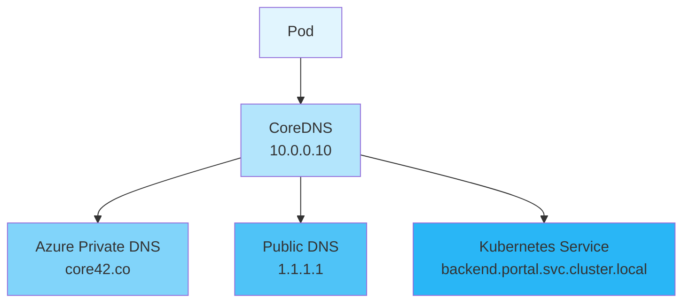

On a regular workday, the development team encountered an unusual issue: a Pod in the Kubernetes cluster suddenly couldn't access external domains. While this problem seemed simple at first, it involved multiple aspects including Kubernetes DNS, Azure Private DNS, and service discovery. Let's explore how to diagnose and solve this issue.

<!--more-->

## Problem Description

Developers discovered that when trying to access external domains from within a Pod, they encountered DNS resolution failures:

```bash
$ curl https://product-service-test.jiejue.ai
curl: (6) Could not resolve host:product-service-test.jiejue.ai
```

## Deep Investigation

### Step 1: Verify DNS Query

First, we used the `nslookup` command to check domain resolution:

```bash
$ nslookupproduct-service-test.jiejue.ai
Server:         10.0.0.10
Address:        10.0.0.10:53

** server can't findproduct-service-test.jiejue.ai: NXDOMAIN
```

Here we found our first key information: the default DNS server is `10.0.0.10`, and it returned an NXDOMAIN (domain doesn't exist) error.

### Step 2: Try Alternative DNS Servers

Next, we tried using a public DNS server (like Cloudflare's 1.1.1.1):

```bash
$ nslookupproduct-service-test.jiejue.ai 1.1.1.1
Server:         1.1.1.1
Address:        1.1.1.1:53

Non-authoritative answer:
Name:  product-service-test.jiejue.ai
Address: 21.274.30.143
```

Interestingly, using a public DNS server resolved the domain correctly! This indicated that the problem wasn't with the domain itself, but with the cluster's DNS configuration.

### Step 3: Analyze DNS Query Process in Detail

Using the `dig` command to get more detailed DNS query information:

```bash
$ dig @10.0.0.10product-service-test.jiejue.ai

;; AUTHORITY SECTION:
core42.co.    10    IN    SOA    azureprivatedns.net. azureprivatedns-host.microsoft.com. 1 3600 300 2419200 10
```

Here we discovered the root cause: `core42.co` domain was defined in Azure Private DNS Zones! This explained why the cluster's DNS server couldn't resolve this domain.

## Root Cause

When we create a Private DNS Zone in Azure, even if it only has one SOA (Start of Authority) record, it takes over the resolution authority for the entire domain. This means:

1. All DNS queries for `*.jiejue.ai` are routed to Azure Private DNS
2. If no matching record is found in the Private DNS Zone, the query fails
3. The DNS server won't query external DNS servers anymore

It's like saying "I'm in charge of this domain!" but not actually having any resolution records configured.

## Solutions

There are two possible solutions:

1. If the domain needs to be accessed through the public internet:

   - Delete the `core42.co` record from Azure Private DNS Zone
   - Or keep only specific subdomains (like `internal.core42.co`) for internal services
2. If this is an internal service:

   - Add corresponding DNS records in the Azure Private DNS Zone
   - Ensure records point to correct internal IP addresses

## Extended Knowledge: Kubernetes Service Discovery

During troubleshooting, we discovered an even better solution. Since the target service was actually deployed in the same Kubernetes cluster, we could use Kubernetes' service discovery mechanism to access it.

Kubernetes provides a unified service discovery format:

```
<service-name>.<namespace>.svc.cluster.local
```

For example:

```bash
$ curl http://api-service.frontend.svc.cluster.local
```

This approach has several important advantages:

1. **Reliability**: No dependency on external DNS resolution
2. **Security**: Internal cluster communication, no need to go through public internet
3. **Performance**: Direct use of internal cluster network
4. **Consistency**: Standard format in any Kubernetes cluster

## Best Practice Recommendations

1. **DNS Configuration Management**:

   - When using Azure Private DNS Zone, clearly plan which domains are for internal services
   - Avoid creating records in Private DNS Zone that might conflict with public domains
2. **Service Access Strategy**:

   - Prioritize using Kubernetes service discovery for cluster-internal services
   - Use dedicated internal domains (like `.internal.company.com`) for internal services
   - Use CoreDNS custom configuration to handle special DNS requirements
3. **Troubleshooting Process**:

   - Use tools like `nslookup` and `dig` to collect detailed information
   - Check response differences between different DNS servers
   - Review DNS configuration and cloud provider settings

## Important Notes

In practice, also keep in mind:

1. Modifying DNS configuration can affect network communication across the entire cluster
2. Test DNS setting changes in a test environment before applying to production
3. Maintain good documentation, including DNS configuration change history

Through this troubleshooting experience, we not only solved the specific problem but also deepened our understanding of Kubernetes networking and DNS resolution mechanisms. This knowledge will be helpful in daily operations and problem-solving.

## Technical Diagram

Here's a diagram showing the DNS resolution process and Kubernetes service discovery mechanism.



I hope this article helps you understand and solve DNS issues in Kubernetes. If you have any questions, feel free to discuss in the comments!
