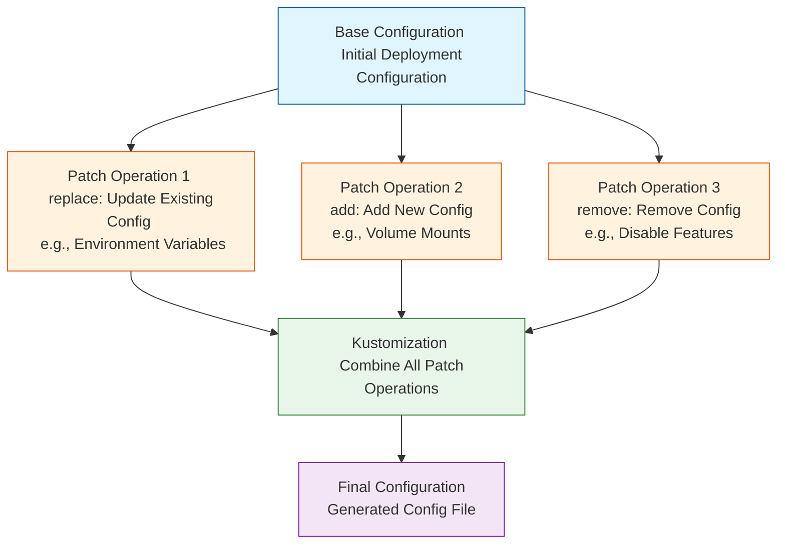

When managing Kubernetes configurations, we often need to adjust settings for different environments. For instance, test and production environments might require different parameter configurations, or certain features might only be enabled in specific environments. This is where Kustomize's patches functionality becomes invaluable.

<!--more-->

## What are Kustomize Patches?

Kustomize patches are a declarative way to modify configurations, allowing us to customize Kubernetes resources without directly modifying the original YAML files. This approach is particularly suitable for managing multi-environment deployments, as it helps maintain uniformity in base configurations while accommodating environment-specific requirements.

## Common Types of Patch Operations

Let's understand the main types of Kustomize patch operations through practical examples:

### 1. replace Operation: Updating Existing Configurations

The `replace` operation is used to update existing values in configurations. This is particularly useful when updating environment-specific configurations, such as service URLs or environment variables:

```yaml
patches:
  - target:
      kind: ConfigMap
      name: batch-configmap
    patch: |
      - op: replace
        path: /data/KEY_VAULT_URL
        value: https://example-keyvault.vault.azure.net/
```

In this example, we're replacing the KEY_VAULT_URL value in the ConfigMap. The `replace` operation requires that the target path already exists, otherwise it will fail.

### 2. add Operation: Adding New Configurations

The `add` operation is used to add new configuration items to resources. This is very useful when adding extra functionality for specific environments:

```yaml
patches:
  - target:
      kind: Deployment
      name: batch-processing
    patch: |
      - op: add
        path: /spec/template/spec/volumes
        value:
          - name: secrets-store-inline
            csi:
              driver: secrets-store.csi.k8s.io
              readOnly: true
```

This example shows how to add a new volume configuration to a Deployment. The `add` operation can add new elements at any valid JSON path.

### 3. remove Operation: Removing Configurations

The `remove` operation is used to delete unwanted configuration items:

```yaml
patches:
  - target:
      kind: Deployment
      name: batch-processing
    patch: |
      - op: remove
        path: /spec/template/spec/volumes/0
```

This operation removes the configuration item at the specified path. When using `remove`, ensure the target path exists, or it will result in an error.

## Advanced Patch Usage

### 1. Conditional Patches

Sometimes we need to apply patches based on specific conditions. This can be achieved using target selectors:

```yaml
patches:
  - target:
      kind: Deployment
      labelSelector: "environment=production"
    patch: |
      - op: add
        path: /spec/replicas
        value: 3
```

### 2. Array Operations

When working with array elements, you can use specific syntax:

```yaml
patches:
  - target:
      kind: Deployment
      name: batch-processing
    patch: |
      - op: add
        path: /spec/template/spec/containers/0/env/-
        value:
          name: NEW_ENV
          value: "value"
```

Here, the `-` indicates adding an element at the end of the array.

## Best Practices

When using Kustomize patches, there are several important best practices to keep in mind:

1. **Path Accuracy**: Ensure JSON paths exactly match the target location, including case sensitivity.

2. **Incremental Changes**: When performing complex patch operations, it's recommended to proceed step by step, validating the generated configuration at each step:
   ```bash
   kubectl kustomize . | kubectl apply --dry-run=client -f -
   ```

3. **Version Control**: Keep patch files for different environments in their respective directories for better management and change tracking.

4. **Documentation**: Add comments to important patch operations explaining their purpose and impact.

## Common Pitfalls in Patch Operations

1. **Non-existent Paths**: Ensure target paths exist when using `replace` or `remove` operations.

2. **Array Indices**: Pay attention to index values when operating on arrays, as incorrect indices will cause operation failures.

3. **Value Types**: Ensure added or replaced values match the target location's type. For example, you can't replace a numeric value with a string.

## Practical Tips

In real projects, the following workflow is recommended:

1. Create base configuration files first
2. Create separate kustomization files for each environment
3. Use patches to handle environment-specific changes
4. Preview generated configurations using `kubectl kustomize` before applying changes

Example directory structure:
```
deployment/
├── base/
│   ├── deployment.yaml
│   └── kustomization.yaml
├── dev/
│   ├── kustomization-patch.yaml
└── prod/
    └── kustomization-patch.yaml
```

## Summary

Kustomize's patch functionality provides a powerful and flexible solution for Kubernetes configuration management. Through appropriate use of `replace`, `add`, and `remove` operations, we can effectively manage configuration differences across environments while maintaining consistency in base configurations. The key is understanding the appropriate scenarios for each operation and following best practices to ensure maintainability and reliability in configuration management.

- Patch Operation Flow Diagram

