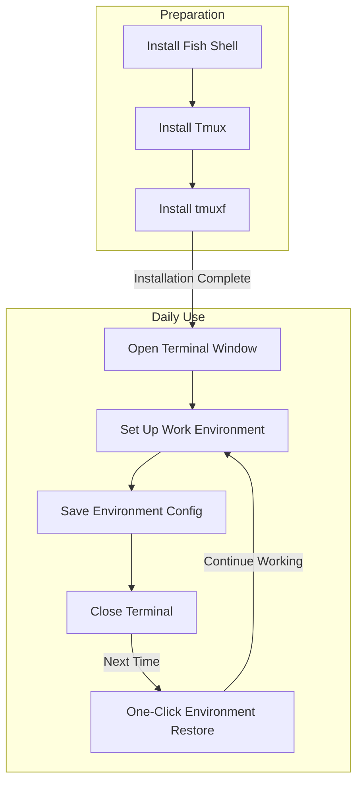

Do you often need to handle multiple projects simultaneously, repeatedly opening multiple terminal windows, typing various commands to switch directories and launch programs? Today, I'll introduce a simple tool that lets you easily save and restore your terminal work environment!

<!--more-->

## Real-world Work Challenges

John is a developer whose first task every morning at work is to open the terminal and:

1. Open project A's directory and start the development server
2. Create a new window to view project B's logs
3. Open another window to run system monitoring tools
4. Prepare another window for executing various commands...

These operations need to be repeated every day, which is not only time-consuming but sometimes leads to forgotten steps. If the computer restarts or the terminal unexpectedly closes, everything needs to be set up again, which is quite troublesome.

## Solution: tmuxf Terminal Environment Manager

The tool we're introducing today can help you:

- Save all current terminal window layouts with one click
- Remember each window's working directory and running programs
- Instantly restore your previous work environment
- Support saving multiple different environment configurations

[An illustration showing the tool in action, demonstrating the process of saving and loading sessions is needed here]

## Installation Steps

1. First, ensure you have the following installed on your computer:
   - Fish Shell (terminal environment)
   - Tmux (terminal multiplexer)

If not yet installed, you can install them using these commands:

```bash
# Install using homebrew on macOS
brew install fish tmux

# On Ubuntu/Debian Linux systems
sudo apt-get install fish tmux
```

2. Create configuration directories:

```fish
mkdir -p ~/.config/fish/{functions,completions}
```

3. Download tool files (execute these commands in sequence in the terminal):

```fish
# Create program file
curl -o ~/.config/fish/functions/tmuxf.fish https://github.com/donghao1393/fish-assistant/raw/refs/heads/main/plugins/tmuxf/functions/tmuxf.fish

# Create auto-completion file
curl -o ~/.config/fish/completions/tmuxf.fish https://github.com/donghao1393/fish-assistant/raw/refs/heads/main/plugins/tmuxf/completions/tmuxf.fish
```

## Usage

Once installed, you can start using it! Common commands include:

1. Save current work environment:

```fish
tmuxf save environment-name
```

2. Restore a previously saved environment:

```fish
tmuxf load environment-name
```

3. View list of saved environments:

```fish
tmuxf list
```


## Useful Tips

1. You can create different environment configurations for different projects, such as:

   - `tmuxf save work` - save work environment
   - `tmuxf save study` - save study environment
   - `tmuxf save blog` - save blogging environment

2. If a program takes time to start, you can add a delay:

```fish
tmuxf load work --delay 0.5
```

3. To modify an existing environment, use the force option:

```fish
tmuxf save work --force
```

## Common Questions

- **Q: Can I open multiple environments simultaneously?**
  - A: Yes! Each environment is independent, and you can load multiple different environments at the same time.
- **Q: Where are the configuration files stored?**
  - A: All configurations are saved in the `~/.config/tmuxf/` directory as `.fish` files.
- **Q: How do I delete unwanted environment configurations?**
  - A: Use `tmuxf delete environment-name` to delete.

## Summary

With this simple tool, you can:

- Say goodbye to repetitive environment setup work
- Quickly restore your work state
- Improve daily work efficiency

No matter how powerful a tool is, nothing beats actually using it. Give it a try now!


