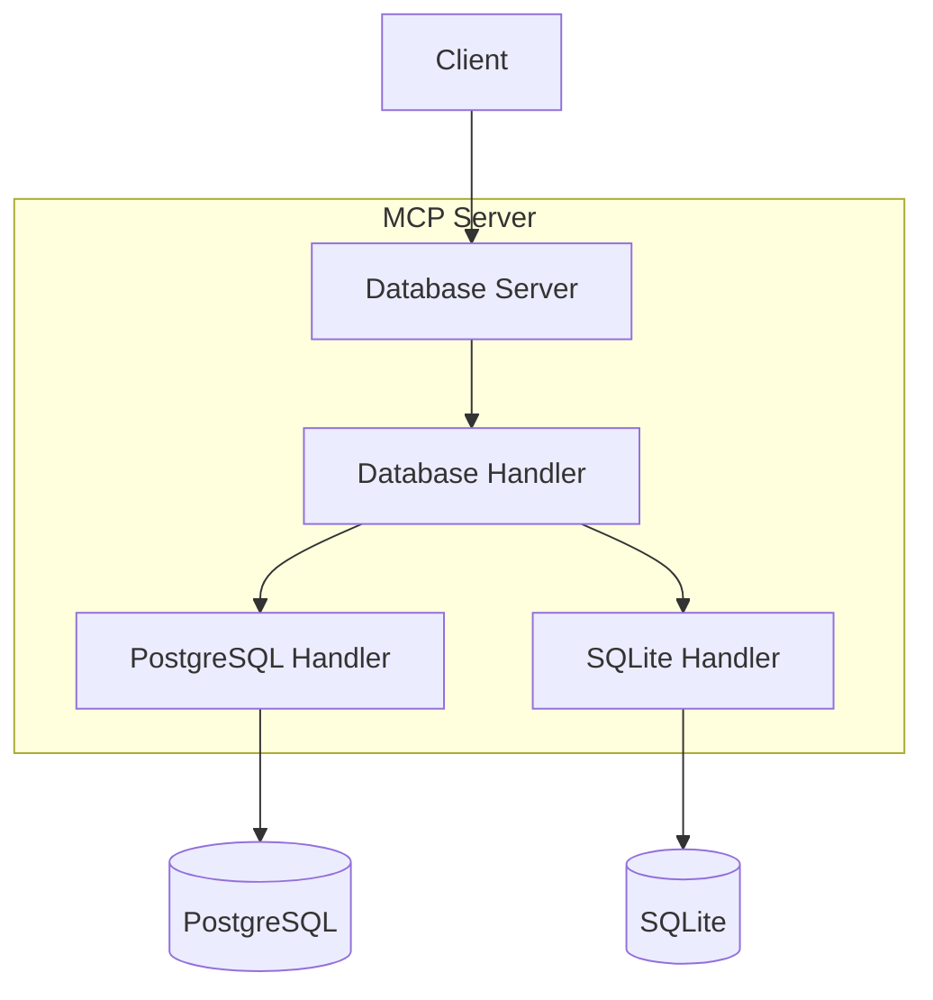
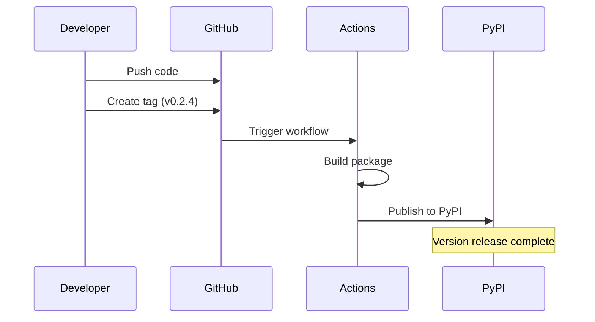

This article delves deep into the design philosophy of the MCP database service and the complete process of developing and releasing an MCP service. For developers interested in MCP service development or currently building their own MCP services, the experiences shared here might be helpful.

<!--more-->

## Architecture Design

### Abstraction Layer Design



The abstraction layer is the core of the entire service, addressing these key issues:

1. **Interface Unification:** Through the DatabaseHandler abstract base class, defining a unified interface ensures all database implementations follow the same API specifications.
2. **Implementation Isolation:** Specific database implementations (like PostgreSQL and SQLite) are independent, making it easy to add support for new databases.
3. **Flexible Configuration:** Runtime configuration and specific implementations are separated, supporting dynamic database switching without code modifications.

### Release Process



Evolution from v0.1.0 to v0.2.4:

1. v0.1.0: Initial PostgreSQL Implementation
   - Basic query functionality
   - Connection pool management
   - Error handling
   
2. v0.2.0: Architecture Reorganization
   - Project renamed to mcp-dbutils
   - Introduction of abstraction layer design
   - Improved configuration management

3. v0.2.1: SQLite Support
   - Added SQLite basic functionality
   - Unified error handling
   - URI connection support

4. v0.2.2-v0.2.4: Continuous Improvements
   - Enhanced documentation
   - Improved configuration experience
   - Added automated release

### Automated Release Process

GitHub Actions configuration example:

```yaml
name: Publish to PyPI

on:
  release:
    types: [published]

jobs:
  publish:
    runs-on: ubuntu-latest
    environment: pypi
    permissions:
      id-token: write

    steps:
      - uses: actions/checkout@v4
      - uses: astral-sh/setup-uv@v4
        with:
          enable-cache: false
      
      - name: Build and Publish
        run: |
          uv python install
          uv sync --all-extras
          uv build
          uv publish
```

Key points explained:
1. Using `setup-uv` instead of traditional pip for faster installation
2. Enabling trusted publishing for enhanced security
3. Automated build and release process

## Best Practices

### Version Management

1. Semantic Versioning
   - MAJOR.MINOR.PATCH format
   - Increment MAJOR for breaking changes
   - Increment MINOR for new features
   - Increment PATCH for fixes

2. Changelog Maintenance
   - Use consistent format
   - Sort by version number in descending order
   - Categorize entries (Added/Changed/Fixed)

### Release Process

1. Code Preparation
   ```bash
   # Update version number
   edit pyproject.toml
   # Update CHANGELOG
   edit CHANGELOG.md
   # Commit changes
   git add .
   git commit -m "chore: bump version to x.y.z"
   ```

2. Create Release
   ```bash
   # Create tag
   git tag vx.y.z
   git push origin vx.y.z
   ```

3. Automated Release
   - GitHub Actions triggers automatically
   - PyPI updates automatically
   - Users can immediately use the new version

### Documentation Maintenance

Good documentation should include:
1. Detailed installation instructions
2. Configuration file examples
3. Basic usage tutorials
4. API documentation
5. Architecture explanation
6. Contribution guidelines

## Future Outlook

1. Database Support Extension
   - MongoDB support
   - Redis support
   - More relational databases

2. Feature Enhancements
   - Query result caching
   - More database operations (within security limits)
   - Performance monitoring

3. Tool Improvements
   - Enhanced command-line tools
   - Configuration validation tools
   - Developer debugging tools

Continuous iteration and improvement are key to project success. Through standardized release processes and comprehensive documentation, we can better maintain and develop this MCP service.
