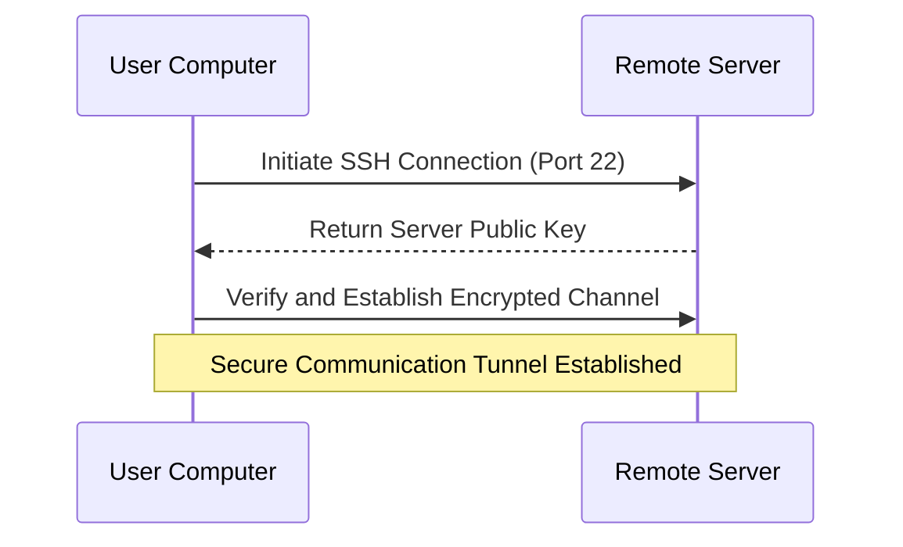
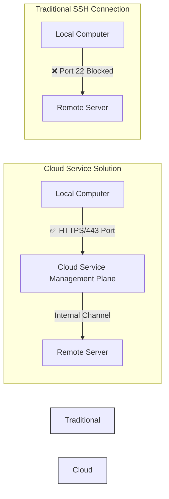
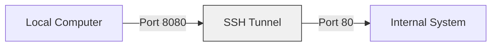
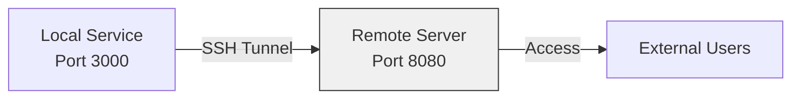
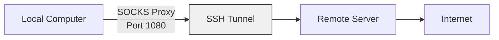

In today's work environment, remote server connections and accessing internal systems are common requirements. This article will start with basic SSH connections and gradually introduce network tunneling technology to help you understand and use these powerful tools.

<!--more-->

## SSH: The Foundation of Remote Connections

SSH (Secure Shell) is a secure remote connection tool. Imagine you need to handle some files in an office in another city. Before remote connections, you might have needed to go there in person. But with SSH, you can securely "log in remotely" to that computer and operate it as if you were sitting in front of it.



The most basic SSH connection command is:
```bash
ssh username@server
# Example: ssh john@192.168.1.100
```

## Port Forwarding: Building Bridges for Data Transfer

SSH isn't just for remote login; it can establish secure data transfer channels. It's like building an underground tunnel between two cities for safely transporting various resources.

1. Local Port Forwarding
```bash
ssh -L 8080:internal.server:80 username@server
```

2. Remote Port Forwarding
```bash
ssh -R 8080:localhost:3000 username@server
```

3. Dynamic Port Forwarding
```bash
ssh -D 1080 username@server
```

## Cloud Service Solutions When Traditional SSH is Restricted

Sometimes, traditional SSH connections are blocked due to network policies (e.g., port 22 being blocked):



In such cases, we can use special channels provided by cloud services. Taking Azure as an example, it provides the `az ssh vm` command:

```bash
# Basic connection
az ssh vm -n VM_NAME -g RESOURCE_GROUP

# Using port forwarding
az ssh vm -n VM_NAME -g RESOURCE_GROUP -- -L 8080:internal:80
```

Key features of this solution:
- Uses HTTPS (port 443) to establish connections, bypassing common port restrictions
- Provides additional security through the cloud platform's management channel
- Supports the same port forwarding features as standard SSH

## Practical Applications of Port Forwarding

### 1. Accessing Internal Systems


Example commands:
```bash
# Traditional SSH
ssh -L 8080:internal.system:80 user@server

# Cloud service solution
az ssh vm -n myVM -g myGroup -- -L 8080:internal.system:80
```

### 2. Sharing Local Services


Example commands:
```bash
# Traditional SSH
ssh -R 8080:localhost:3000 user@server

# Cloud service solution
az ssh vm -n myVM -g myGroup -- -R 8080:localhost:3000
```

### 3. Setting Up Proxy Services


Example commands:
```bash
# Traditional SSH
ssh -D 1080 user@server

# Cloud service solution
az ssh vm -n myVM -g myGroup -- -D 1080
```

## How to Verify Connection Status?

1. Check if ports are listening:
```bash
# View locally listening ports
lsof -i :1080
```

2. Test proxy connection:
```bash
# Test SOCKS proxy using curl
curl --socks5 localhost:1080 "https://api.ipify.org?format=json"
```

3. Use proxy for specific programs:
```bash
# Set environment variables
export https_proxy=socks5://localhost:1080
export http_proxy=socks5://localhost:1080
```

## Common Issues and Solutions

1. **Connection Reset**
   - Check if network connection is stable
   - Confirm if server allows this type of connection
   - Verify if firewall rules permit the connection

2. **Proxy Settings Not Working**
   - Check if corporate security software is managing proxy settings
   - Try application-level proxy configuration
   - Consider using applications that support independent proxy settings

3. **Performance Issues**
   - Choose servers in closer geographic locations
   - Avoid forwarding too many ports in a single connection
   - Regularly clean up unused connections

## Security Recommendations

1. Use strong passwords and key authentication
2. Close unnecessary connections promptly
3. Follow company network usage policies
4. Regularly update client and server software
5. Avoid plaintext transmission in public networks

## Summary

Whether using traditional SSH or cloud service solutions, they all provide secure and flexible network connection methods. Understanding how these tools work helps us:
- Find alternatives when networks are restricted
- Securely access internal systems
- Flexibly handle various network connection needs

Choosing appropriate connection methods and following security principles makes remote work and system access more convenient and secure.
