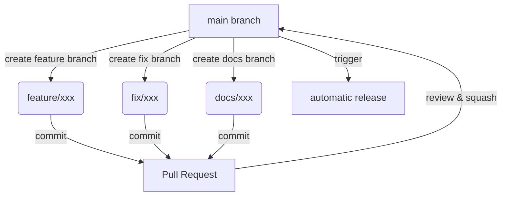
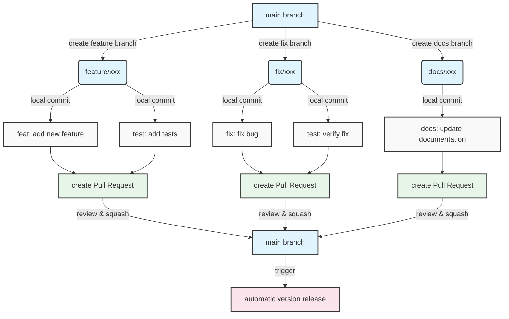
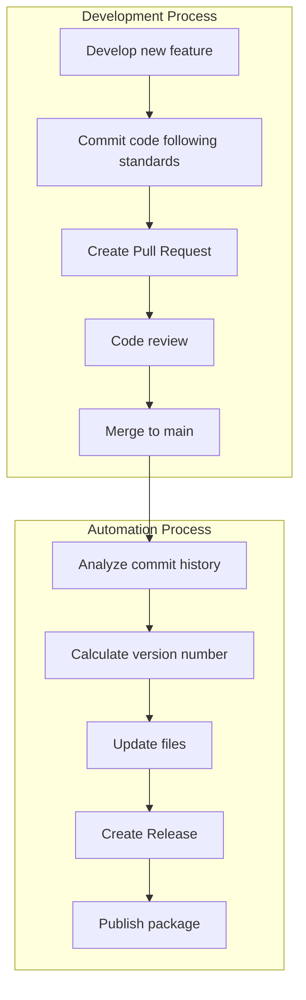

While optimizing our project's release process recently, I discovered that although we all know "standards are important," we often fall into the trap of "ignoring standards for quick releases." This article will share how to make project releases more controllable and efficient through automation tools and standardized processes.

<!--more-->

## From Manual to Automated: Why Change?

In traditional manual release processes, we typically need to:
1. Manually update version numbers
2. Update changelog
3. Create release
4. Publish to package management platforms

This process has several obvious issues:
- Easy to forget version updates
- Inconsistent changelog formats
- Varying release notes quality
- Possible missing release steps

More importantly, manual operations make the release process unpredictable and difficult to replicate. We need a more automated and standardized solution.

## Choosing Automation Tools

Among many automation tools, the semantic-release series (especially python-semantic-release) provides a complete solution. It can:

1. Automatically determine version numbers
2. Automatically generate changelogs
3. Automatically create releases
4. Automatically publish to PyPI

The core philosophy of the tool is to drive the entire release process through standardized commit messages.

## Standardizing Commit Messages

To fully utilize automation tools, we first need to standardize commit messages. The standard format is:

```bash
<type>(<scope>): <description>

[optional detailed description]

[optional footer]
```

The types mainly include:
- feat: New feature
- fix: Bug fix
- docs: Documentation updates
- style: Code formatting adjustments
- refactor: Code refactoring
- test: Test-related
- chore: Build process or auxiliary tool changes

For example:

```bash
feat(database): Add connection pool auto-cleanup feature

Added automatic cleanup mechanism for idle connections, configurable cleanup interval.
Supports manual cleanup triggering.

Breaking Changes:
- Removed old manual connection close interface
```

## Branch Management Best Practices

To ensure commit quality and traceability, we recommend a branch-based development model:



### Branch Naming Conventions
- feature/xxx: New feature development
- fix/xxx: Bug fixes
- docs/xxx: Documentation updates
- chore/xxx: Build script updates



### Pull Request Best Practices

1. Use templates to ensure necessary information
2. Perform self code review
3. Use squash when merging to keep main branch history clean
4. Ensure commit messages follow standards

## Automated Release Process

The complete automated release process is as follows:



### Tool Configuration

Taking python-semantic-release as an example, add configuration to pyproject.toml:

```toml
[tool.semantic_release]
version_variable = [
    "pyproject.toml:version",
]
branch = "main"
upload_to_pypi = true
upload_to_release = true
build_command = "python -m build"
```

### GitHub Actions Configuration

```yaml
name: Release
on:
  push:
    branches: [main]

jobs:
  release:
    runs-on: ubuntu-latest
    steps:
      - uses: actions/checkout@v4
        with:
          fetch-depth: 0
      
      - name: Python Semantic Release
        uses: python-semantic-release/python-semantic-release@v8.7.2
        with:
          github_token: ${{ secrets.GITHUB_TOKEN }}
```

## Best Practices Suggestions

1. Version Number Management
   - Strictly follow semantic versioning specifications
   - Let tools automatically handle version number updates
   - Do not manually modify version numbers

2. Commit Messages
   - Use tools (such as commitizen) to assist in generating standardized commit messages
   - Review commit message standards during the PR phase
   - Ensure final commit messages are clear and meaningful when merging

3. Branch Strategy
   - Protect the main branch, requiring PR merges
   - Use named feature branches
   - Delete merged branches promptly

4. Release Process
   - Configure automated testing to ensure code quality
   - Use environment variables to manage sensitive information
   - Maintain complete documentation for each release version

## Advanced Suggestions

1. Pre-release Versions
   - Use beta/alpha tags for pre-releases
   - Perform thorough testing in pre-release environments

2. Multi-package Management
   - Consider using monorepo tools (such as changesets)
   - Uniformly manage multiple package version releases

3. Release Notifications
   - Integrate Slack/DingTalk notifications
   - Automatically generate release announcements

## Summary

Automated release is not just about tool usage, but a shift in development culture. It requires us to:
- Pay more attention to commit message quality
- Focus on standardized development processes
- Care about code changes' impact

Through standardization and automation, we can:
- Improve release efficiency
- Reduce human errors
- Enhance project quality
- Promote team collaboration

Most importantly, these practices make project maintenance more sustainable and professional.

---

## Related Resources

- [Conventional Commits](https://www.conventionalcommits.org/)
- [Semantic Versioning](https://semver.org/)
- [python-semantic-release](https://python-semantic-release.readthedocs.io/)
- [GitHub Actions](https://docs.github.com/cn/actions)
- [About pull request merges](https://docs.github.com/en/pull-requests/collaborating-with-pull-requests/incorporating-changes-from-a-pull-request/about-pull-request-merges)
